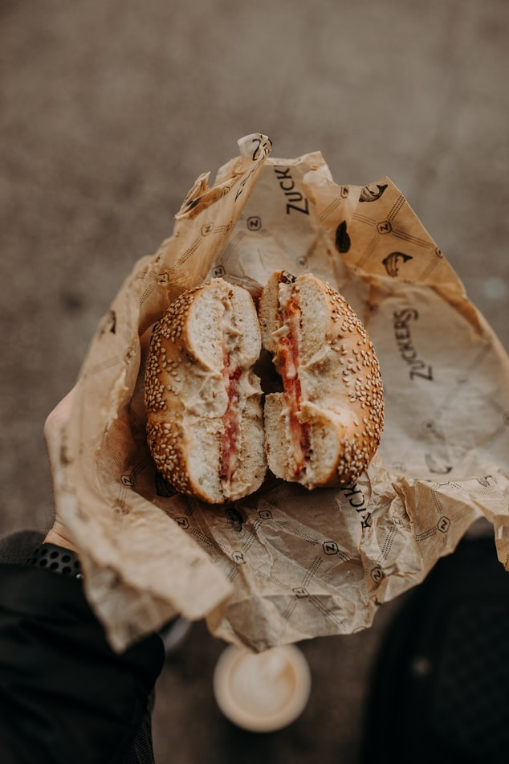

<!doctype html>
<html lang="zh_tw">

<head>
    <title>40618209</title>
    <!-- Required meta tags -->
    <meta charset="utf-8">
    <meta name="viewport" content="width=device-width, initial-scale=1, shrink-to-fit=no">

    <!-- Bootstrap CSS -->
    <link rel="stylesheet" href="https://stackpath.bootstrapcdn.com/bootstrap/4.3.1/css/bootstrap.min.css"
        integrity="sha384-ggOyR0iXCbMQv3Xipma34MD+dH/1fQ784/j6cY/iJTQUOhcWr7x9JvoRxT2MZw1T" crossorigin="anonymous">
    <link rel="stylesheet" href="SCSS/style.css">
</head>

<body>
<!-- <header class="header-class"></header> -->

      <section class="py-5 container-fluid bg1-class">
        

            

                <h1 class="text-center text-white bg1-text">麵包國魚</h1>
            

            

                
            

        

    </section>

<!-- 1 -->
  

</body>

</html>
